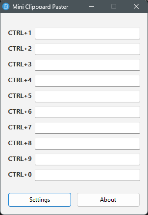
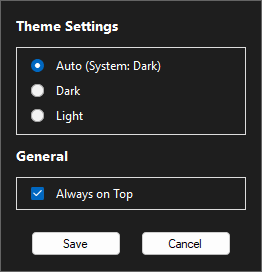

# 📋 Mini Clipboard Paster

**A lightweight, portable, and efficient clipboard manager tool for Windows.** *Boost your daily workflow efficiency with instant hotkey pasting.*

---

## ✨ Features

* **⚡ 10 Customizable Slots:** Store frequently used text snippets easily.
* **⌨️ Instant Hotkeys:** Paste directly using `CTRL + 1` through `CTRL + 0`.
* **🎨 Smart Theme Support:** Auto-detects system theme (Dark/Light) or lets you choose manually.
* **📌 Always on Top:** Keep the window visible while you work (Toggle in Settings).
* **🚀 Portable:** Single `.exe` file. No installation required. No dependencies.
* **🖱️ System Tray Integration:** Minimize to tray to save space. Right-click for menu.

## 📸 Screenshots

| **Dark Theme** | **Light Theme** | **Settings** |
|:---:|:---:|:---:|
|  |  |  |

> *Note: Application automatically adapts to your system theme.*

## 🚀 How to Use

1.  **Run the Application:** Open `MiniClipboardPaster.exe`.
2.  **Save Text:** Type or paste your desired text into the slots (1-10).
3.  **Paste:** Place your cursor where you want to paste and press the corresponding hotkey:
    * `CTRL + 1` for Slot 1
    * ...
    * `CTRL + 0` for Slot 10
4.  **Settings:** Click the **Settings** button to change the theme or toggle "Always on Top".
5.  **Tray:**
    * **Left Click:** Open application.
    * **Right Click:** Show menu (Show/Exit).
    * **Close (X):** Completely exits the application.

## 🛠️ Tech Stack

* **Language:** AutoIt v3
* **Platform:** Windows (XP / 7 / 8 / 10 / 11)
* **Framework:** None (Native Win32 API)

## 🏗️ Building from Source

Want to build it yourself? Check out the [Build Instructions](BUILD.md).

## 📞 Contact

**Developer:** Eagle  
**Email:** trup40@protonmail.com

---

  © 2025 Eagle. All Rights Reserved.

