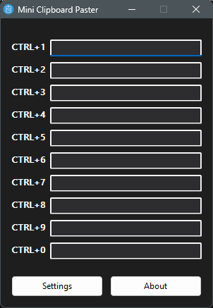
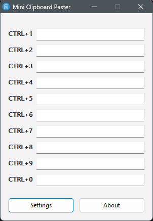
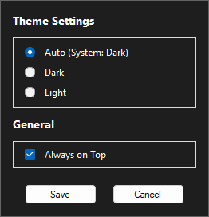

# 📋 Mini Clipboard Paster

**Windows için hafif, taşınabilir ve verimli bir pano (clipboard) yöneticisi.** *Anında kısayol yapıştırma özelliğiyle günlük iş akışı verimliliğinizi artırın.*

[English](README.md) | [Türkçe](README.tr.md)

---

## ✨ Özellikler

* **⚡ 10 Özelleştirilebilir Alan:** Sık kullandığınız metin parçacıklarını kolayca yazın.
* **⌨️ Kısayollar:** `CTRL + 1` ile `CTRL + 0` arasını kullanarak doğrudan yapıştırın.
* **🎨 Akıllı Tema Desteği:** Sistem temasını (Koyu/Açık) otomatik algılar veya manuel seçmenize olanak tanır.
* **📌 Her Zaman Üstte:** Çalışırken pencereyi görünür tutun (Ayarlardan değiştirilebilir).
* **🚀 Taşınabilir:** Tek bir `.exe` dosyası. Kurulum gerektirmez. Bağımlılık içermez.
* **🖱️ Sistem Tepsisi Entegrasyonu:** Yerden tasarruf etmek için tepsiye (tray) küçültün. Menü için sağ tıklayın.

## 📸 Ekran Görüntüleri

| **Koyu Tema** | **Açık Tema** | **Ayarlar** |
|:---:|:---:|:---:|
|  |  |  |

> *Not: Uygulama sistem temanıza otomatik olarak uyum sağlar.*

## 🚀 Nasıl Kullanılır

1.  **Uygulamayı Çalıştırın:** `MiniClipboardPaster.exe` dosyasını açın.
2.  **Metni Kaydedin:** İstediğiniz metni alanlara (1-10) yazın veya yapıştırın.
3.  **Yapıştırın:** İmlecinizi yapıştırmak istediğiniz yere getirin ve ilgili kısayol tuşuna basın:
    * 1.Yuva için `CTRL + 1`
    * ...
    * 10.Yuva için `CTRL + 0`
4.  **Ayarlar:** Temayı değiştirmek veya "Her Zaman Üstte" özelliğini açıp kapatmak için **Ayarlar** (Settings) butonuna tıklayın.
5.  **Sistem Tepsisi (Tray):**
    * **Sol Tık:** Uygulamayı açar.
    * **Sağ Tık:** Menüyü gösterir (Göster/Çıkış).
    * **Kapat (X):** Uygulamadan tamamen çıkar.

## 🛠️ Teknoloji

* **Dil:** AutoIt v3
* **Platform:** Windows (XP / 7 / 8 / 10 / 11)
* **Framework:** Yok (Yerel Win32 API)

## 🏗️ Kaynaktan Derleme

Kendiniz mi derlemek istiyorsunuz? [Derleme Talimatlarına](BUILD.md) göz atın.

## 📞 İletişim

**Geliştirici:** Eagle  
**E-posta:** trup40@protonmail.com

---

  © 2025 Eagle. Tüm Hakları Saklıdır.

## ☕ Bağış Yap

Geliştirdiğim bu yazılım tamamen ücretsiz ve açık kaynaklıdır. Eğer projem işinize yaradıysa, bana bir kahve ısmarlayarak çalışmalarıma destek olabilirsiniz! 🚀

### 🪙 Kripto Para Adreslerim

| Coin | Ağ (Network) | Cüzdan Adresi |
| :--- | :--- | :--- |
| **USDT (Tether)** | **TRC20** (Tron) | `TWxJVQ3PBCd8ZJJVkX2joe8WRGcSCdh8Ws` |
| **BTC (Bitcoin)** | Bitcoin (Bech32)| `bc1q7207qk3wk94a94xvxx43lxawsg69zpm0atvtd8` |
| **ETH (Ethereum)** | ERC20 | `0x1f5A2e35752c6f01c753F334292Fc7635Caeef56` |
| **BNB** | **BSC** (BEP20) | `0x93845c5Fb889C36E072B5683f1616C625C2deBe7` |

> [!IMPORTANT]
> Lütfen gönderim yaparken **Ağ (Network)** seçiminin yukarıdaki tablo ile birebir aynı olduğundan emin olun. Yanlış ağ seçimi varlık kaybına neden olabilir.
